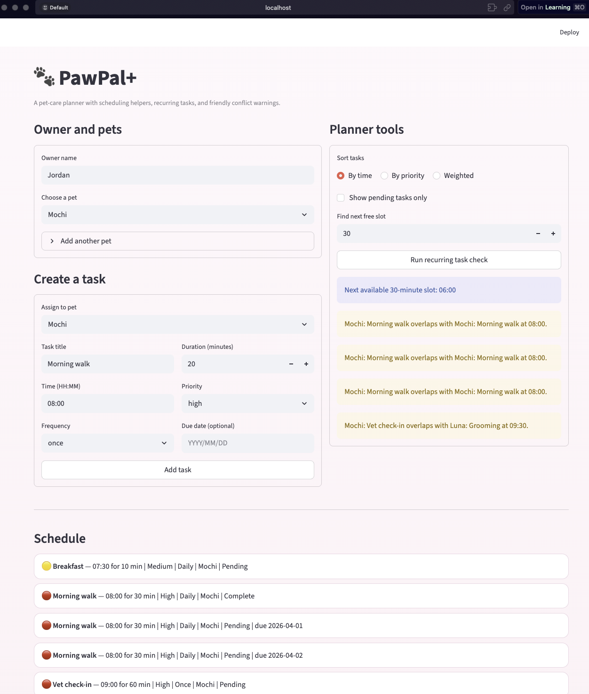
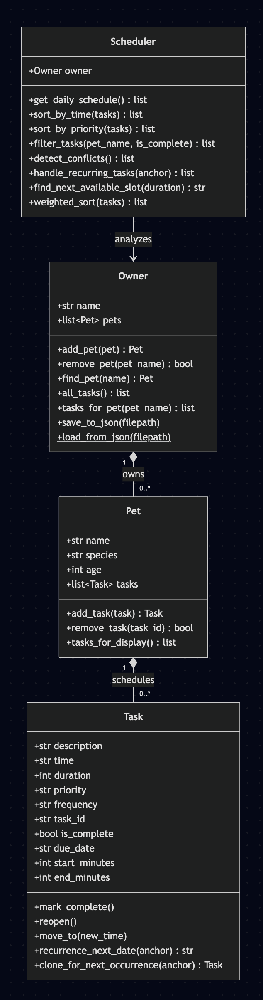

# PawPal+ (Module 2 Project)

You are building **PawPal+**, a Streamlit app that helps a pet owner plan care tasks for their pet.

## Scenario

A busy pet owner needs help staying consistent with pet care. They want an assistant that can:

- Track pet care tasks (walks, feeding, meds, enrichment, grooming, etc.)
- Consider constraints (time available, priority, owner preferences)
- Produce a daily plan and explain why it chose that plan

Your job is to design the system first (UML), then implement the logic in Python, then connect it to the Streamlit UI.

## What you will build

Your final app should:

- Let a user enter basic owner + pet info
- Let a user add/edit tasks (duration + priority at minimum)
- Generate a daily schedule/plan based on constraints and priorities
- Display the plan clearly (and ideally explain the reasoning)
- Include tests for the most important scheduling behaviors

## Getting started

### Setup

```bash
python -m venv .venv
source .venv/bin/activate  # Windows: .venv\Scripts\activate
pip install -r requirements.txt
```

### Suggested workflow

1. Read the scenario carefully and identify requirements and edge cases.
2. Draft a UML diagram (classes, attributes, methods, relationships).
3. Convert UML into Python class stubs (no logic yet).
4. Implement scheduling logic in small increments.
5. Add tests to verify key behaviors.
6. Connect your logic to the Streamlit UI in `app.py`.
7. Refine UML so it matches what you actually built.

---

## Features

- **Owner & Pet Management**: Create an owner profile and add multiple pets with species info.
- **Task Scheduling**: Add tasks with time, duration, priority (high/medium/low), and frequency (once/daily/weekly).
- **Sorting by Time**: View all tasks sorted chronologically using Python's `sorted()` with a lambda key on "HH:MM" strings.
- **Sorting by Priority**: Tasks are ordered high → medium → low using a priority-weight mapping.
- **Filtering**: Filter tasks by pet name or completion status.
- **Conflict Warnings**: The scheduler detects when multiple tasks are scheduled at the same time and displays warnings.
- **Daily Recurrence**: When a daily or weekly task is marked complete, a new instance is automatically created for the next due date using `timedelta`.
- **Schedule Generation**: Produces a daily plan sorted by priority first, then by time, with a reasoning explanation.

---

## Smarter Scheduling

The `Scheduler` class acts as the system's "brain" with the following algorithmic features:

1. **Priority-then-time sorting**: Tasks are sorted by a numeric priority weight (`high=3, medium=2, low=1`) in descending order, with time as a secondary sort key. This ensures urgent tasks surface first while maintaining chronological order within the same priority.

2. **Conflict detection**: Groups pending tasks by time slot and flags any slot with 2+ tasks. This is a lightweight approach that checks exact time matches rather than overlapping durations — a reasonable tradeoff for a daily planner where most tasks are at fixed times.

3. **Recurring task automation**: When `mark_task_complete()` is called on a daily/weekly task, `create_next_occurrence()` uses `timedelta(days=1)` or `timedelta(days=7)` to generate the next instance and auto-adds it to the pet's task list.

4. **Next available slot finder** (Extension): `find_next_available_slot()` scans from 07:00 to 21:00 in 30-minute increments, converts HH:MM to minutes-since-midnight, and checks each candidate against all occupied time ranges using overlap detection (`candidate < occ_end and candidate_end > occ_start`). Unlike the basic conflict detection which only checks exact time matches, this algorithm is duration-aware — a 60-minute task at 08:00 correctly blocks the 08:30 slot. This was implemented using Agent Mode to coordinate changes across the Scheduler class and the Streamlit UI.

5. **JSON data persistence** (Extension): The Owner class has `save_to_json()` and `load_from_json()` class methods that serialize the entire object graph (Owner → Pets → Tasks) to a `data.json` file. Each class implements `to_dict()` and `from_dict()` for clean conversion. Dates use ISO format strings for JSON compatibility. The Streamlit app auto-loads saved data on startup and saves after every mutation (add pet, add task, complete task).

---
## Scheduling Architecture

The app separates data storage from planning logic.

- `Owner` aggregates pets and can flatten tasks across the household.
- `Pet` owns task objects but does not decide scheduling rules.
- `Scheduler` is the planning layer. It computes views like sorted schedules, overlap warnings, recurring follow-ups, and free time suggestions.

That split keeps the UI thin and makes the logic easier to test.

## Files

- `app.py` — Streamlit interface
- `pawpal_system.py` — backend models and scheduler
- `main.py` — sample CLI walkthrough
- `tests/test_pawpal.py` — behavior checks
- `reflection.md` — project reflection
- `uml_diagram.mmd` / `uml_diagram.png` — system design artifact

## Notes on validation

The included tests cover:
- task completion state updates
- pet task insertion
- chronological sorting
- recurring task creation
- overlap/conflict warnings

Additional future tests could cover malformed input, task deletion flows, and more advanced recurrence policies.

---

## Demo




